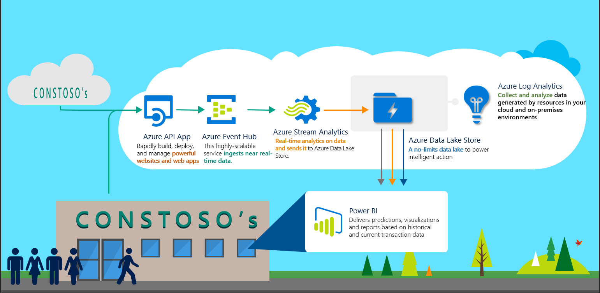

# Azure Digitial Marketing - Pixel Tracker Continuous Release Guide

## Table of Contents
- [Introduction](#introduction)
- [Prerequisites](#prerequisites)
- [Architecture](#architecture)
- [Setup Steps](#setup-steps)

## Introduction

Tche objective of this Guide is to demonstrate how to configure a continuous release enviromenet in Visual Studio Team services to build and publish the pixel tracker solution.

## Prerequisites

The steps described later in this guide require the following prerequisites:

1.  An [Azure subscription](https://azure.microsoft.com/en-us/) with login credentials
2. A [Visual Studo Team Services](https://www.visualstudio.com/en-us/docs/setup-admin/team-services/sign-up-for-visual-studio-team-services) account

## Architecture

Figure 1 illustrates the Azure architecture that we will create.

 
Figure 1: Architecture

## Setup Steps

The following are the steps to deploy the end-to-end solution for the predictive pipelines.

### Accessing Files in the Git Repository

This tutorial will refer to files available in the [Java](https://github.com/Azure/azure-pixel-tracker-java) and [ARM](https://github.com/Azure/azure-pixel-tracker-arm) submodules of the [Azure Digitial Marketing Pixel Tracker git repository](https://github.com/Azure/azure-pixel-tracker). You can download all of these files at once by clicking the "Clone or download" button on the repository.

You can download or view individual files by navigating through the repository folders. If you choose this option, be sure to download the "raw" version of each file by clicking the filename to view it, then clicking Download.

### Choose a Unique String

You will need a unique string to identify your deployment because some Azure services, e.g. Azure Storage requires a unique name for each instance across the service. We suggest you use only letters and numbers in this string and the length should not be greater than 9.
 
We suggest you use "[UI]pixeltracker[N]"  where [UI] is the user's initials,  N is a random integer that you choose and characters must be entered in in lowercase. Please open your memo file and write down "unique:[unique]" with "[unique]" replaced with your actual unique string.

### Configure the Azure Resource Management template gating build
1. Log into the [Visual Studio Team Services Portal](visualstudio.com/) and navitage to the desired account.
1. Navitage to the desired team's *Code* section.
1. Select *Import repository* from the repository drop down menu.
    1. Enter **https://github.com/Azure/azure-pixel-tracker-arm** for "Clone URL".
     1. During PREVIEW use credentials, and enter your github username and github personal access token
    1. Choose a "Name" for your new repository.
    1. Complete the task by clicking "Import"
1. Create a gating build to validate the master branch before commits can be made.
    1. Select "Set up build" in the "Files" view of your new repository.
    1. Select "Empty process" in the "Select a template" page.
    1. Provide a "Name" for your build, such as **[UI]'s Pixel Tracker ARM Gating Build**
    1. Choose a default agent queue, such as **Hosted**
        1. Advanced users may configure their own build agent.
    1. Select "Add Task", and choose the **Azure Resource Group Deployment** task.
        1. Choose an "Azure subscription" from the drop down menu. 
        1. Provide a name for the Resource Group, such as **[UI]pixeltracker[N]**.
        1. Choose a "Location" for deploying the resource group.
        1. Provide a "Template" location, which by default will be **azuredeploy.json**.
        1. Provide a "Template paramters" location, which by default will be **azuredeploy.parameters.json**.
        1. Change "Deployment mode" from **Incremental** to **Validation only**.
    1. Select "Save & queue".
 1. Configure the gating build to execute when a pull request is created by enabling protection on the master branch.
    1. Return to the "Files" tab of your repository. 
    1. Select "Manage repositories" from the repositories drop down menu. 
    1. Select your repository from the list. 
    1. Select "Master" from the drop down below your repository name. 
    1. Select "Branch Policies" 
        1. Check "Protect this branch", note this will force all code changes to be submitted via pull request for this branch. 
        1. Select "+Add build policy"
            1. Choose the "Build definition" that you created in the previous step.
            1. Select "Save".

### Configure the Java gating build
1. Select *Import repository* from the repository drop down menu.
    1. Enter **https://github.com/Azure/azure-pixel-tracker-java** for "Clone URL".
     1. During PREVIEW use credentials, and enter your github username and github personal access token
    1. Choose a "Name" for your new repository.
    1. Complete the task by clicking "Import"
1. Create a gating build to validate the master branch before commits can be made.
    1. Select "Set up build" in the "Files" view of your new repository.
    1. Select "Empty process" in the "Select a template" page.
    1. Provide a "Name" for your build, such as **[UI]'s Pixel Tracker Java Gating Build**
    1. Choose a default agent queue, such as **Hosted**
        1. Advanced users may configure their own build agent.
    1. Select "Add Task", and choose the **Gradle** task.
        1. Enter *test* for "Tasks"
        1. Change "Test Results Files" to **\*\*/build/test-results/test/TEST-*.xml**
        1. Choose a "Location" for deploying the resource group.
        1. Provide a "Template" location, which by default will be **azuredeploy.json**.
        1. Provide a "Template paramters" location, which by default will be **azuredeploy.parameters.json**.
        1. Change "Deployment mode" from **Incremental** to **Validation only**.
    1. Select "Save & queue".
 1. Configure the gating build to execute when a pull request is created by enabling protection on the master branch.
    1. Return to the "Files" tab of your repository. 
    1. Select "Manage repositories" from the repositories drop down menu. 
    1. Select your repository from the list. 
    1. Select "Master" from the drop down below your repository name. 
    1. Select "Branch Policies" 
        1. Check "Protect this branch", note this will force all code changes to be submitted via pull request for this branch. 
        1. Select "+Add build policy"
            1. Choose the "Build definition" that you created in the previous step.
            1. Select "Save".   
            
### Configure the Java artifacts build
1. From the "Build" tab, select "+New"
	1. Select "Empty process" in the "Select a template" page.
	1. Provide a "Name" for your build, such as **[UI]'s Pixel Tracker Java Artifact Build**
    1. Choose a default agent queue, such as **Hosted**
    1. Select "Add Task", and choose the **Gradle** task.
        1. Enter *build* for "Tasks"
        1. Change "Test Results Files" to **\*\*/build/test-results/test/TEST-*.xml**
        1. Select **Cobertura** for the "Code Coverage Tool"
		1. Select "Run FindBugs"
    1. Select "Add Task", and choose the **Copy Files** task.
		1. Enter **$(build.sourcesdirectory)** for "Source Folder"
		1. Enter **\*\*/\*.jar** for "Contents"
		1. Enter **$(build.artifactstagingdirectory)** for "Target Folder"
	1. Select "Add Task", and choose the **Copy Files** task.
		1. Enter **server/src/main/resources** for "Source Folder"
		1. Enter **\*.config** for "Contents"
		1. Enter **$(build.artifactstagingdirectory)** for "Target Folder"
    1. Select "Add Task", and choose the **Publish Build Artifacts** task.
		1. Enter **$(build.artifactstagingdirectory)** for "Path to Publish"
		1. Enter **drop** for "Artifact Name"            
2. Pixel Tracker Java

    2.1 Import Pixel Tracker Java from Github to VSTS
      
    2.2 Create Build to gate master branch
    
    2.3 Create Build to compile master branch    

    2.4.1 Create Release Env to execute and clean up Functuional Test
          
    2.4.2 Create Release Env for deployment
